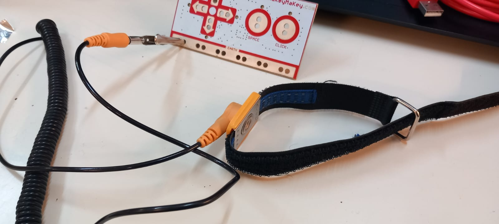
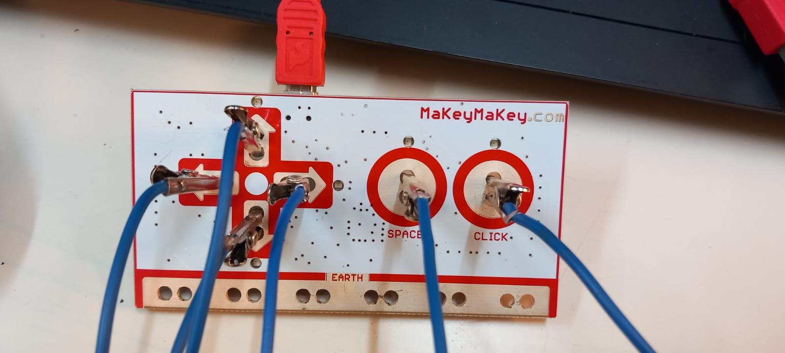
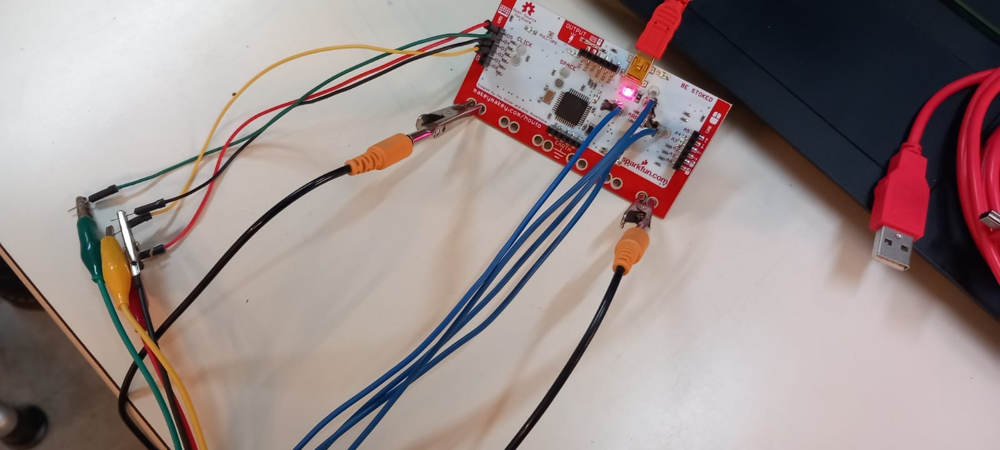
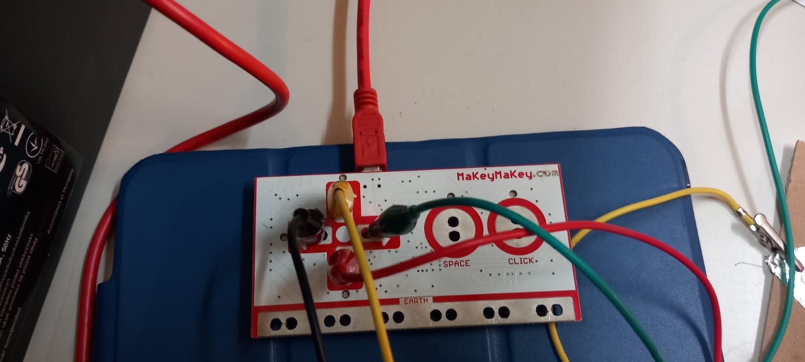

= Makey Makey
Joachim Pelzeder, Tamara Melcher
2022: Dokumentation des Stationenbetriebs „Makey Makey“
:toc:
:icons: font
:url-quickref: https://docs.asciidoctor.org/asciidoc/latest/syntax-quick-reference/

== Erdungsband 

* Krokodilklemme am Makey Makey unten befestigen und an der spielenden Person am Arm mit Klettverschluss festmachen

== Banana Piano

* 6 Bananen
* Makey Makey
* 6 Krokodilklemmen
* 1 Erdungsband

Link: https://apps.makeymakey.com/play/#piano

== Makey Makey Soccer

* Clipboard
* Zettel
* Bleistift 6B
* Makey Makey
* 8 Krokodilklemmen
* 2 Erdungsband
* 4 Steckkabeln

Link: https://apps.makeymakey.com/v2/#makey%20soccer

== Match the beat (with balloons maybe)

* 4 Krokodilklemmen
* Makey Makey
* 1 Erdungsband
* (4 Luftballons)

Link: https://apps.makeymakey.com/v2/#match%20the%20beat

== Geometry Dash

* Karton
* Alufolie
* Makey Makey

Leertaste und schnell genug???

== Maze with Keys

* 4 Krokodilklemmen
* Makey Makey
* 1 Erdungsband
* Steuerungspult (Controller) mit Plastilin (Play-Doh) als Pfeile

Link: https://plays.org/game/mazes-and-keys/

