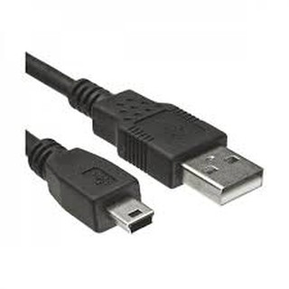

= Makey Makey
Joachim Pelzeder, Tamara Melcher
2022: Dokumentation des Stationenbetriebs „Makey Makey“
:toc:
:icons: font
:url-quickref: https://docs.asciidoctor.org/asciidoc/latest/syntax-quick-reference/

== Inventur der Materialien von Makey Makey

* 7x Makey Makey
* 4x Makro USB Kabel

* 5x Erdungsbänder

== Noch brauchen

* 6 bzw. 8 (falls kaputt) Bananen
* Play-Doh Plastilin
* 6x Ballon
* Bleistift 6B
* Zettel
* Klemmbrett
